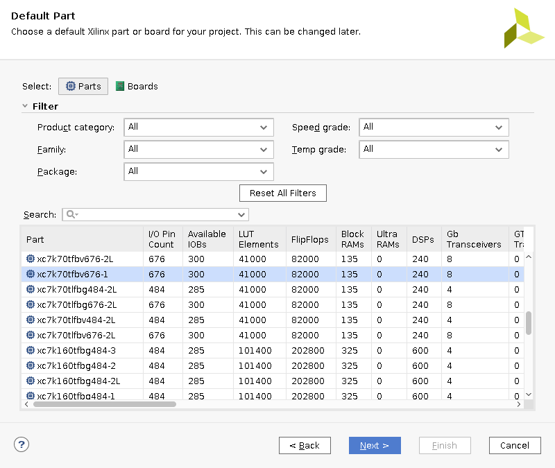
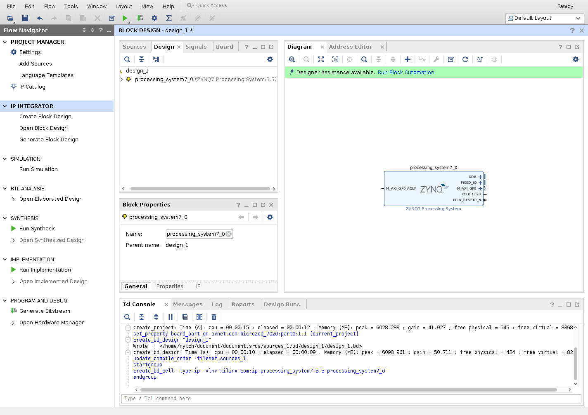
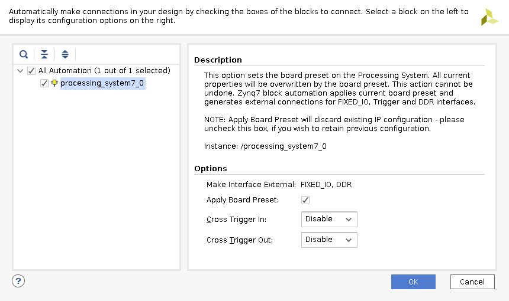
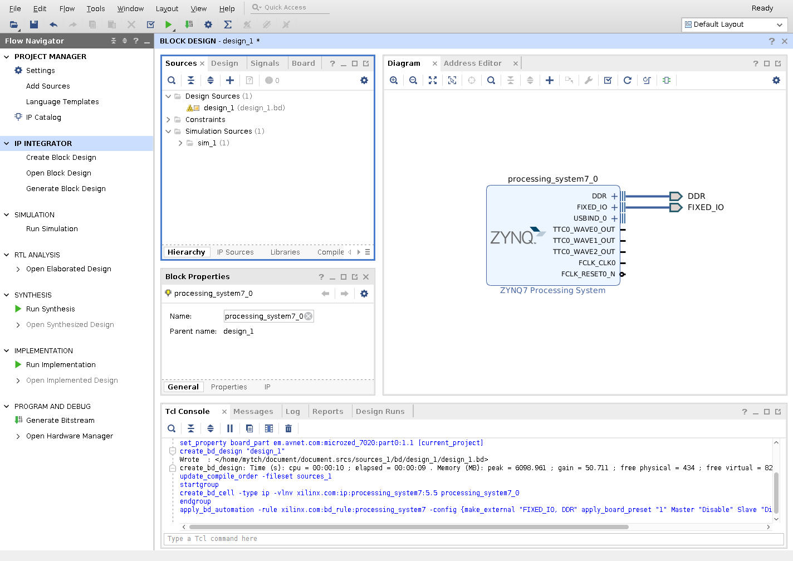
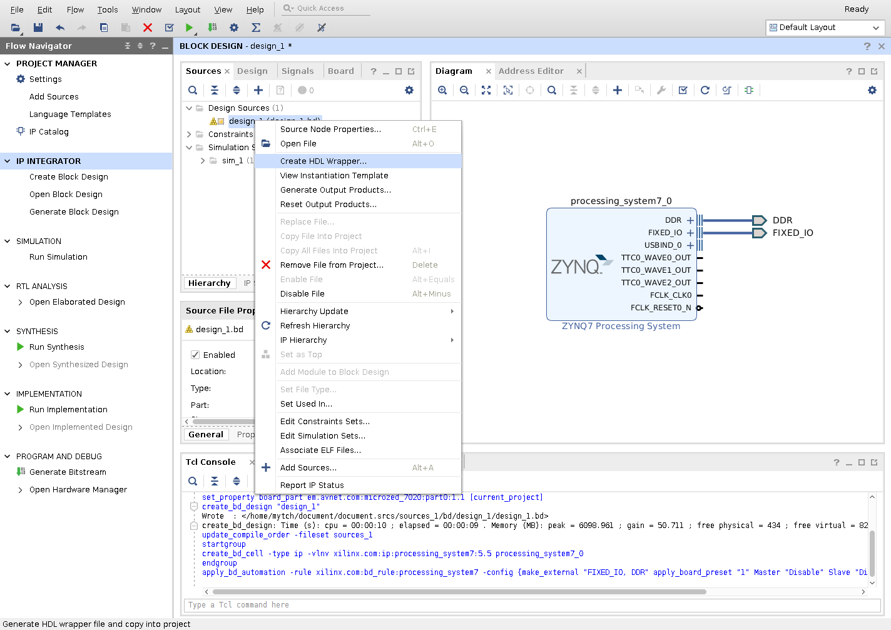
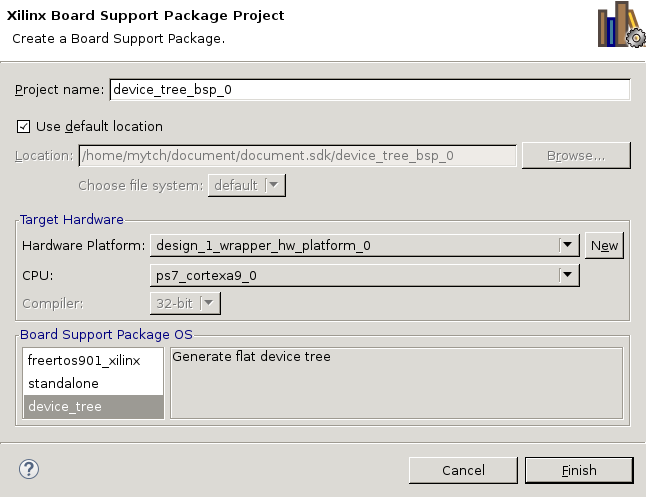
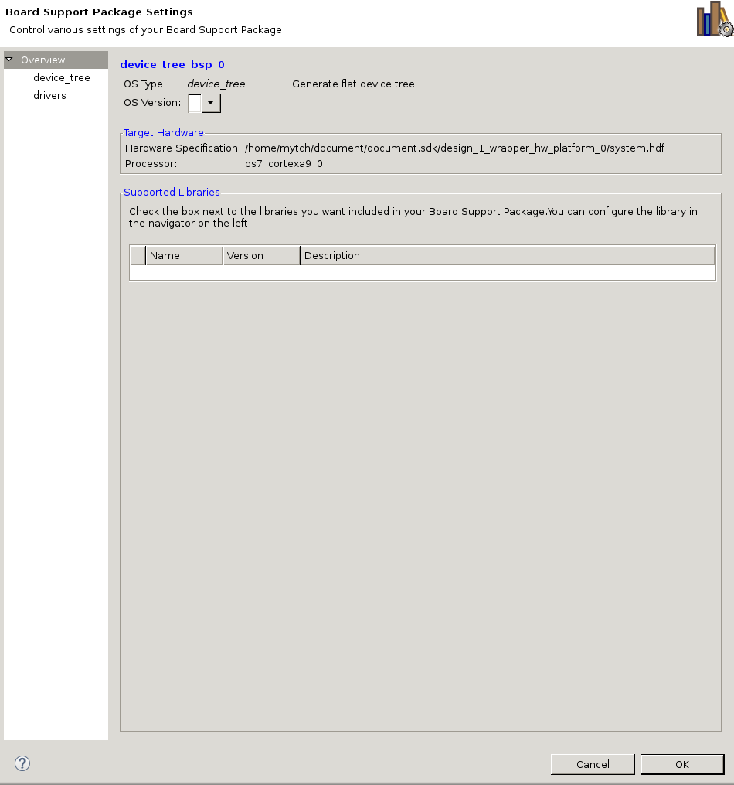
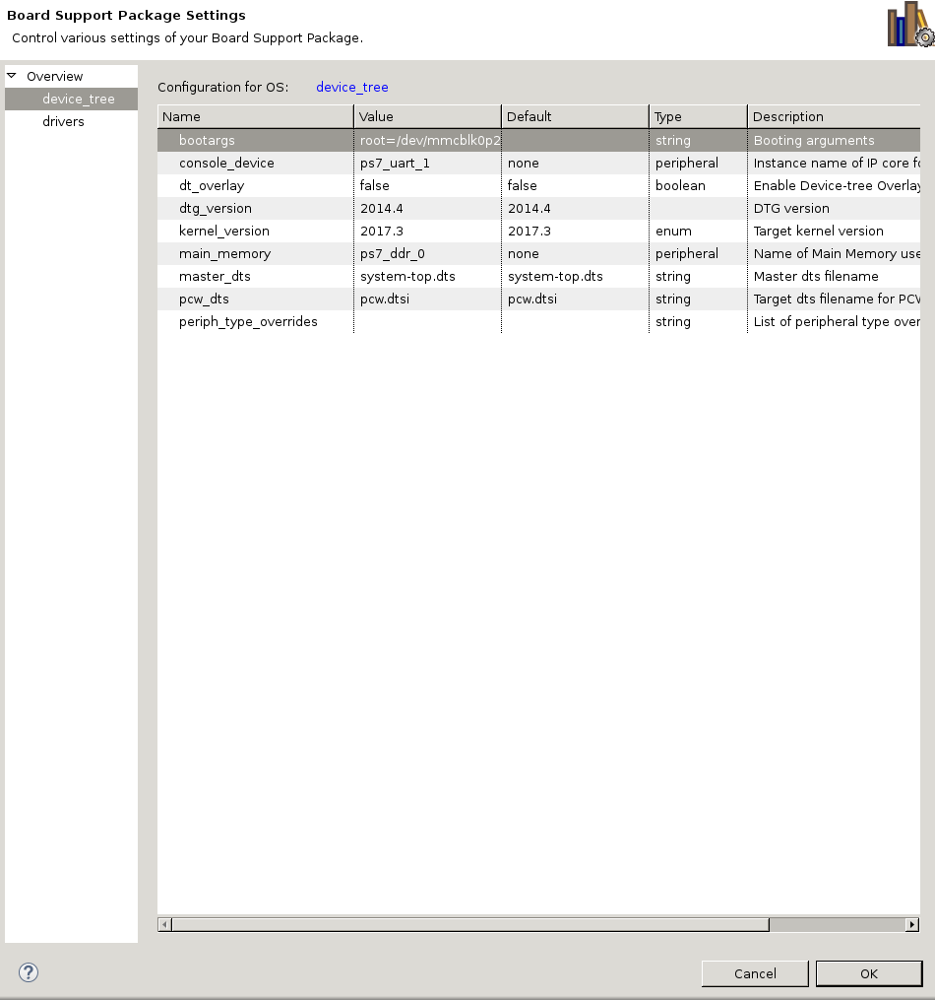

Installing Linux on the MicroZed
================================

You will need 
  - Xilinx Vivado and SDK 17.3 or similar, 
  - The Xilinx ports of
    - [U-Boot](https://github.com/Xilinx/u-boot-xlnx)
      branch xilinx-v2017.3.
    - [Linux](https://github.com/Xilinx/linux-xlnx)
      branch xilinx-v2017.3.
    - [Device Tree](https://github.com/Xilinx/device-tree-xlnx).
  - The MicroZed board definition files from 
    [zedboard](http://zedboard.org/support/documentation/1519),
    I used [this file](http://zedboard.org/sites/default/files/documentations/Avnet%20Zed%20Board%20Definitions%202015_3or4_2016_1or2_160826_3.zip).

We will start with Vivado and build a bitstream for the zynq's PL.
We will create the bare minimum for now but later on you can add IP
and modules to program the FPGA.

First extract the board definition files and copy them to 
`$XILINX/Vivado/2017.3/data/boards/board_files/`

Next create a new project of the RTL type. Skip through until 
you get to the 'Default Part' screen



and select the appropriate microzed board.

Once the project is ready create a new block design and click
add IP. Search for and select the "ZYNQ7 Processing System".



Run block automation, making sure to select "Apply Board Preset".



This will set up the Zynq so that it is connected to most of the
periferals on the board (UART, Ethernet, SD cards, etc).



Next create an HDL wrapper for the design. Go to sources and 
right click on your design, select "Create HDL Wrapper". Select 
"Let Vivado manage wrapper and auto-update".
 


Now generate the bitstream. This will take a while.

Now export the hardware and open the SDK from File->Export->Export Hardware
(including the bitstream) and File->Launch SDK.

At this point the bit stream has been generated but we still need
a few other parts. For now create a directory somewhere that I will
refer to as `$BOOT` and copy 
`$project_dir/$project_name.sdk/design_1_wrapper_hw_platform_0/design_1_wrapper.bit` 
into it, calling it `zynq.bit`.

Now we need to create a device tree for linux.

In the SDK from the menu go Xilinx->Repositories and add a new 
repository from device-tree-xlnx you downloaded earlier. Now
create a device tree by creating a new Board Support Package and
selecting device tree as its type. 



A window will open like:



Go to "device tree" and change the bootargs to 
"root=/dev/mmcblk0p2 rw rootwait" like so:



Wait for the sources to regenerate and use dtc (from your 
os's reposity or device-tree-xlnx) to generate a device tree blob.

```
dtc -I dts -O dtb -o $BOOT/devicetree.dtb $project_dir/$project_name.sdk/device_tree_bsp_0/system-top.dts
```

This is what linux will use to find what devices and memory are
avaliable and what drivers to use for them.

Now it is time to build U-Boot and Linux. You can close Vivado 
and the SDK and open a shell in u-boot-xlnx's directory. Run:

```
# Set the cross compile envionment variables.
CROSS_COMPILE=arm-linux-gnueabihf-
ARCH=arm

# Build the default configuration.
make zynq_microzed_config
make

# Now copy the output.

cp spl/boot.bin u-boot.img $BOOT/

```

Next we need to compile the linux kernel.

```
# Again set the cross compiler variables
CROSS_COMPILE=arm-linux-gnueabihf-
ARCH=arm

# And build the default configuration
make xilinx_zynq_defconfig
make LOADADDR=0x8000 uImage

# And copy the image.

cp arch/arm/boot/uImage $BOOT/
```

Now you need a uenv.txt file like:

```
fpgaaddr=0x1000000
loadaddr=0x8000
fdtaddr=0x100
fpgaload=load mmc 0 ${fpgaaddr} zynq.bit
fpgaboot=fpga loadb 0 ${fpgaaddr} $filesize
mmcload=load mmc 0 ${loadaddr} uImage; load mmc 0 ${fdtaddr} devicetree.dtb
mmcboot=bootm ${loadaddr} - ${fdtaddr}
uenvcmd=run fpgaload; run fpgaboot; run mmcload; run mmcboot
```

Which will load the fpga image, device tree blob and linux image then boot.
Make sure `loadaddr` is the same value as your kernel is compiled for. 
`fpgaaddr` has some restrictions. And make sure none of them overlap.
Put this in your `$BOOT` directory.

At this point you should be able to boot the zynq if you 
format an SD card with a fat partition (64MB, type c, works, set the
bootable flag) and copy
the contents of your `$BOOT` directory to it. It should boot but
fail once it tries to mount the root partition.

So make an ext3 partition with the remaining space on the card and
put a linux distrobution on in. For example debian can be installed 
using debootstrap and qemu. 

```
# Make and mount the parition.
mkfs.ext3 /dev/mmcblk0p2
mount /dev/mmcblk0p2 /mnt
qemu-debootstrap --arch armhf stretch /mnt 

# Copy the apt sources.
cp /etc/apt/sources.list /mnt/etc/apt/

# Chroot into and setup the environment.
chroot /mnt
useradd zynq
```

Put the SD card back in the microzed and try booting.

And you should now have a working linux distrobution.


